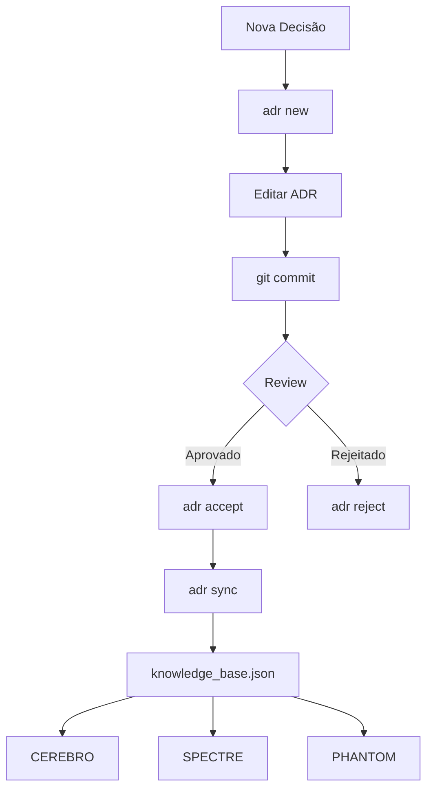

# 📜 ADR Ledger - Livro Razão de Decisões Arquiteturais

> **Knowledge as Law** - Decisões arquiteturais como fonte de verdade para sistemas inteligentes

```
╔══════════════════════════════════════════════════════════════════════════╗
║                                                                          ║
║   ███████╗████████╗ █████╗  ██████╗██╗  ██╗                             ║
║   ██╔════╝╚══██╔══╝██╔══██╗██╔════╝██║ ██╔╝                             ║
║   ███████╗   ██║   ███████║██║     █████╔╝                              ║
║   ╚════██║   ██║   ██╔══██║██║     ██╔═██╗                              ║
║   ███████║   ██║   ██║  ██║╚██████╗██║  ██╗                             ║
║   ╚══════╝   ╚═╝   ╚═╝  ╚═╝ ╚═════╝╚═╝  ╚═╝                             ║
║                                                                          ║
║   CEREBRO · SPECTRE · PHANTOM · NEUTRON                                 ║
║                                                                          ║
╚══════════════════════════════════════════════════════════════════════════╝
```

## 🎯 O que é isso?

Este repositório é o **Livro Razão** (ledger) de todas as decisões arquiteturais da stack inteligente. Funciona como:

1. **Sistema de Governança**: Quem pode aprovar o quê, quando, e porquê
2. **Knowledge Base**: Fonte de verdade para CEREBRO (RAG), SPECTRE (análise), PHANTOM (ML)
3. **Audit Trail**: Histórico imutável de decisões para compliance (LGPD, SOC2)
4. **Integration Hub**: Output parseável para sistemas inteligentes

## 🏗️ Arquitetura

```
adr-ledger/
├── .schema/                    # JSON Schema para validação
│   └── adr.schema.json
├── .governance/                # Governança como código
│   └── governance.yaml
├── .parsers/                   # AST Parser (Python)
│   └── adr_parser.py
├── adr/                        # ADRs por status
│   ├── proposed/              # 🟡 Aguardando aprovação
│   ├── accepted/              # 🟢 Em vigor
│   ├── superseded/            # ⚪ Substituídas
│   └── rejected/              # 🔴 Rejeitadas
├── projects/                   # Documentação por projeto
│   ├── CEREBRO/
│   ├── SPECTRE/
│   ├── PHANTOM/
│   └── NEUTRON/
├── knowledge/                  # Output para sistemas
│   ├── knowledge_base.json    # → CEREBRO
│   ├── spectre_corpus.json    # → SPECTRE
│   ├── phantom_training.json  # → PHANTOM
│   └── graph.json             # Knowledge graph
└── scripts/
    └── adr                    # CLI operacional
```

## 🚀 Quick Start

```bash
# 1. Clone
git clone https://github.com/pina/adr-ledger.git
cd adr-ledger

# 2. Setup CLI
chmod +x scripts/adr
export PATH="$PWD/scripts:$PATH"

# 3. Criar nova ADR
adr new -t "Minha Decisão" -p CEREBRO -c major

# 4. Listar ADRs
adr list

# 5. Sincronizar knowledge
adr sync
```

## 📋 Workflow



## 📊 Stack Inteligente

| Sistema | Função | Consome |
|---------|--------|---------|
| **CEREBRO** | RAG Knowledge System | `knowledge_base.json` |
| **SPECTRE** | Sentiment & Pattern Analysis | `spectre_corpus.json` |
| **PHANTOM** | ML Classification & ETL | `phantom_training.json` |
| **NEUTRON** | Infrastructure & Compliance | `knowledge_base.json` |

## 🔧 CLI Reference

```bash
adr new       # Criar nova ADR
adr list      # Listar ADRs
adr show      # Mostrar detalhes
adr accept    # Aceitar ADR proposta
adr supersede # Marcar como superseded
adr search    # Buscar por texto
adr sync      # Sincronizar knowledge
adr graph     # Gerar grafo Mermaid
adr validate  # Validar ADRs
```

## 🔐 Governança

A governança é definida em `.governance/governance.yaml`:

- **Roles**: architect, engineer, security_lead, agent
- **Approval Matrix**: Quem aprova por classificação
- **Lifecycle Rules**: Estados e transições permitidas
- **Compliance Rules**: LGPD, Security, Infrastructure
- **Automation Hooks**: Triggers automáticos

## 📄 Schema ADR

Cada ADR segue o schema em `.schema/adr.schema.json`:

```yaml
---
id: "ADR-0001"
title: "Título da Decisão"
status: accepted  # proposed, accepted, rejected, deprecated, superseded
date: "2025-01-10"

authors:
  - name: "Pina"
    role: "Security Engineer"

governance:
  classification: "major"  # critical, major, minor, patch
  compliance_tags: ["LGPD", "SECURITY"]

scope:
  projects: [CEREBRO, SPECTRE]
  layers: [data, ml]
  environments: [all]

knowledge_extraction:
  keywords: ["RAG", "vector search"]
  concepts: ["Semantic Search"]
  questions_answered:
    - "Como funciona o retrieval?"
---

## Context
...

## Decision
...

## Consequences
...
```

## 🤖 Integração com Agentes

### CEREBRO (RAG)

```python
from cerebro import KnowledgeBase

kb = KnowledgeBase.from_ledger("./knowledge/knowledge_base.json")

# Query com context de ADRs
response = kb.query("Por que usamos NixOS?")
# → Retorna chunks relevantes + sources
```

### SPECTRE (Analysis)

```python
from spectre import Analyzer

analyzer = Analyzer()
corpus = analyzer.load("./knowledge/spectre_corpus.json")

# Análise de sentimento das decisões
report = analyzer.sentiment_report(corpus)
# → Trends, patterns, anomalies
```

### PHANTOM (Classification)

```python
from phantom import Classifier

clf = Classifier.from_training("./knowledge/phantom_training.json")

# Classificar nova ADR
classification = clf.predict(new_adr_text)
# → {classification: "major", confidence: 0.87}
```

## 📈 Roadmap

- [x] Schema JSON para validação
- [x] Parser AST (Python)
- [x] CLI operacional
- [x] Governance as code
- [x] ADRs fundacionais
- [ ] Git hooks para validação
- [ ] CI/CD integration (GitHub Actions)
- [ ] Web UI para visualização
- [ ] Auto-ingest em CEREBRO
- [ ] GPG signing

## 🧠 Philosophy

> "Not your keys, not your crypto" → "Not your repo, not your architectural rationale"

Este sistema implementa **Knowledge Sovereignty** - a ideia de que uma organização deve ser dona do seu próprio conhecimento, versionado, auditável, e independente de ferramentas SaaS.

## 📜 License

MIT

---

<div align="center">
  <sub>Built with 🧠 for intelligent systems</sub>
</div>
