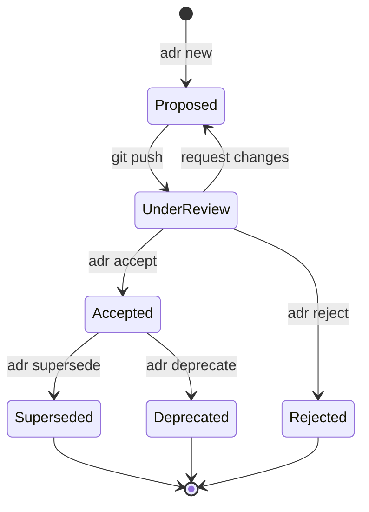

# ADR Ledger — Livro Razão de Decisões Arquiteturais

[](LICENSE)
[](https://www.python.org/)
[](https://nixos.org/)

Registro computável de decisões arquiteturais. Cada ADR é versionado em Git, validado por schema, e exportado como JSON para consumo por agentes de IA.

## Por que existe

Decisões arquiteturais tendem a se dispersar — Notion, Slack, memória de quem estava na sala. Quando alguém pergunta "por que NixOS?", a resposta é reconstruída a partir de fragmentos, se tanto.

O ADR Ledger trata decisões como dados estruturados: YAML frontmatter para máquinas, Markdown para humanos, Git como audit trail. Quatro agentes consomem esse conhecimento:

| Agente | Função | Consome |
|--------|--------|---------|
| **CEREBRO** | RAG retrieval | `knowledge_base.json` |
| **SPECTRE** | Análise de padrões (NLP) | `spectre_corpus.json` |
| **PHANTOM** | Classificação e sanitização | `phantom_training.json` |
| **NEUTRON** | Enforcement de compliance | ADR compliance tags |

O resultado: decisões rastreáveis, versionadas e queryable por humanos e máquinas.

---

## Arquitetura

```
adr-ledger/
├── .schema/                    # JSON Schema para validação
│   └── adr.schema.json
├── .governance/                # Governança como código
│   └── governance.yaml
├── .parsers/                   # AST Parser (Python)
│   └── adr_parser.py
├── .chain/                     # Blockchain layer (provenance)
│   ├── chain.json
│   ├── crypto.py
│   └── ...
├── adr/                        # ADRs por status
│   ├── proposed/
│   ├── accepted/
│   ├── superseded/
│   └── rejected/
├── knowledge/                  # Output para agentes
│   ├── knowledge_base.json    → CEREBRO
│   ├── spectre_corpus.json    → SPECTRE
│   ├── phantom_training.json  → PHANTOM
│   └── graph.json             # Knowledge graph
└── scripts/
    └── adr                    # CLI operacional
```

## Quick Start

```bash
# 1. Clone
git clone https://github.com/marcosfpina/adr-ledger.git
cd adr-ledger

# 2. Setup CLI
chmod +x scripts/adr
export PATH="$PWD/scripts:$PATH"

# 3. Criar nova ADR
adr new -t "Minha Decisão" -p CEREBRO -c major

# 4. Listar ADRs
adr list

# 5. Sincronizar knowledge base
adr sync
```

---

## Workflow

### Cenário 1: Nova decisão — Redis para caching

```bash
# Engenheiro identifica necessidade de decisão arquitetural
$ adr new \
  -t "Add Redis for API Caching" \
  -p SPECTRE \
  -c major

# Output: Created adr/proposed/ADR-0042.md
```

O engenheiro preenche o ADR com contexto, decisão, consequências e alternativas:

```yaml
---
id: "ADR-0042"
title: "Add Redis for API Caching"
status: proposed
date: "2026-01-29"

authors:
  - name: "Maria Silva"
    role: "Backend Engineer"

governance:
  classification: "major"
  requires_approval_from: [architect, security_lead]
  compliance_tags: ["PERFORMANCE", "INFRASTRUCTURE"]

scope:
  projects: [SPECTRE]
  layers: [api, data]
  environments: [staging, production]

knowledge_extraction:
  keywords: ["redis", "caching", "performance"]
  concepts: ["Distributed Caching", "Cache Invalidation"]
  questions_answered:
    - "Why Redis over Memcached?"
    - "How do we handle cache invalidation?"
---

## Context

API response times increased 3x in the last month (p95: 1.2s → 3.6s).
Profiling shows 80% of time spent on repeated database queries.

## Decision

Implement Redis cluster (3 nodes) with TTL-based expiration,
write-through strategy, and Sentinel for HA.

## Consequences

### Positive
- Reduces DB load by ~60%
- Improves p95 latency to <500ms

### Negative
- Additional cost: ~$200/month
- Cache invalidation complexity

## Alternatives Considered

1. **Memcached**: No persistence, limited data structures
2. **PostgreSQL materialized views**: Not real-time enough
3. **Application-level caching**: Doesn't scale across replicas
```

```bash
# Commit aciona validação via pre-commit hook
$ git add adr/proposed/ADR-0042.md
$ git commit -m "ADR-0042: Propose Redis caching for API"

# Após aprovação do arquiteto
$ adr accept ADR-0042

# Sincroniza para os agentes
$ adr sync
```

### Cenário 2: Deprecação — Supersedendo decisão antiga

```bash
# Propor nova decisão que supersede a antiga
$ adr new -t "Deprecate v1 REST API" -p SPECTRE -c critical

# Após aprovação
$ adr supersede ADR-0012 ADR-0043
# ADR-0012 status: accepted → superseded
# Knowledge graph atualizado
```

### Cenário 3: Decisão emergencial — Incidente de segurança

```bash
$ adr new \
  -t "Emergency: Rotate all API keys after breach" \
  -p GLOBAL \
  -c critical

$ adr accept ADR-0044 --fast-track --reason "security-incident-2026-01-29"
$ adr sync
```

### Transições de estado



---

## Pipeline de dados

O fluxo de uma decisão até virar conhecimento queryable:

```
Engineer writes ADR
    → Git commit + pre-commit validation
    → adr sync gera knowledge_base.json
    → PHANTOM chunka e gera embeddings
    → CEREBRO indexa no knowledge vault
    → Agente responde com citações
```

```
┌──────────────────────────────────────────────────────────────┐
│ ADR-LEDGER (source of truth)                                  │
│                                                                │
│  .md files → Parser → JSON artifacts → Git commit             │
└──────────────────┬───────────────────────────────────────────┘
                   │ adr export --format jsonl
                   ▼
┌──────────────────────────────────────────────────────────────┐
│ PHANTOM (sanitização)                                         │
│                                                                │
│  Semantic chunking → Embedding generation → FAISS indexing    │
└──────────────────┬───────────────────────────────────────────┘
                   │ Chunks + embeddings
                   ▼
┌──────────────────────────────────────────────────────────────┐
│ CEREBRO (knowledge vault)                                     │
│                                                                │
│  RAG retrieval → Graph traversal → Context + citations        │
└──────────────────┬───────────────────────────────────────────┘
                   │ MCP / API
                   ▼
┌──────────────────────────────────────────────────────────────┐
│ AI-Agent-OS (interface)                                       │
│                                                                │
│  claude-code → "Why Redis?" → ADR-0042 com citações           │
└──────────────────────────────────────────────────────────────┘
```

### Formato de export (RAG-optimized)

```json
{
  "id": "ADR-0001",
  "type": "architecture_decision",
  "title": "Use NixOS for Infrastructure",
  "status": "accepted",
  "summary": "[ADR-0001] Use NixOS: We will use NixOS...",
  "scope": {
    "projects": ["NEUTRON", "CEREBRO"],
    "layers": ["infrastructure"]
  },
  "knowledge": {
    "what": "Decision text",
    "why": "Context and rationale",
    "implications": {
      "positive": ["Reproducibility", "Rollbacks"],
      "negative": ["Learning curve"]
    },
    "alternatives_rejected": ["Docker Compose", "Kubernetes"]
  },
  "questions": ["Why NixOS?", "How does rollback work?"],
  "keywords": ["nixos", "infrastructure", "declarative"],
  "relations": {
    "supersedes": [],
    "related": ["ADR-0002"],
    "enables": ["ADR-0003"]
  },
  "governance": {
    "classification": "critical",
    "compliance": ["INFRASTRUCTURE"]
  },
  "metadata": {
    "date": "2025-01-10",
    "version": 1,
    "hash": "a1b2c3d4e5f6"
  }
}
```

---

## CLI Reference

```bash
adr new       # Criar nova ADR
adr list      # Listar ADRs
adr show      # Mostrar detalhes
adr accept    # Aceitar ADR proposta
adr supersede # Marcar como superseded
adr search    # Buscar por texto
adr sync      # Sincronizar knowledge base
adr graph     # Gerar grafo Mermaid
adr validate  # Validar ADRs
adr export    # Export como JSON/JSONL
```

### Export e filtering

```bash
# JSON (pretty-printed)
adr export adr/accepted --format json

# JSONL (streaming, uma ADR por linha)
adr export adr/accepted --format jsonl --compact

# Filtros combinados
adr export adr --format jsonl \
  --filter-status accepted \
  --filter-project CEREBRO \
  --since 2026-01-01 \
  --compact

# Integração direta com PHANTOM
adr export adr/accepted --format jsonl --compact | \
  phantom-cli ingest --source adr-ledger
```

Para documentação completa de export, ver [docs/EXPORT_GUIDE.md](docs/EXPORT_GUIDE.md).

---

## Governança

Governança é código, não processo manual. Definida em `.governance/governance.yaml`:

```yaml
approval_matrix:
  critical:
    required_approvals: 2
    approvers: [architect, security_lead]
    review_deadline: "7 days"

  major:
    required_approvals: 1
    approvers: [architect, senior_engineer]
    review_deadline: "3 days"

  minor:
    required_approvals: 1
    approvers: [architect, senior_engineer]
    auto_approve_after: "2 days"

  patch:
    auto_approve: true
    post_review: true
```

### O que é validado automaticamente

Pre-commit hooks verificam:
- Schema YAML contra `.schema/adr.schema.json`
- Campos obrigatórios preenchidos
- Classificação vs. aprovadores corretos (critical exige architect + security_lead)
- Compliance tags coerentes com layers (data layer exige LGPD)
- Seções obrigatórias: Context, Decision, Consequences

Post-commit hooks disparam:
- Sincronização do knowledge base
- Atualização do knowledge graph
- Notificação de stakeholders

### Compliance

O sistema suporta validação automática para frameworks de compliance:

```yaml
compliance_rules:
  LGPD:
    applies_to:
      - layers: [data, api]
      - keywords: ["pii", "personal data"]
    requirements:
      - data_retention_policy: true
      - encryption_at_rest: true

  SOC2:
    applies_to:
      - environments: [production]
    requirements:
      - change_management: true
      - rollback_plan: true
      - monitoring_plan: true
```

### Audit export

```bash
# Pacote de auditoria SOC2
adr governance audit \
  --framework SOC2 \
  --start-date 2026-01-01 \
  --end-date 2026-01-31 \
  --output soc2-audit-jan-2026.zip
```

O pacote inclui ADRs aceitas com trail de aprovação, política de governança, assinaturas GPG verificadas, e relatórios de validação.

---

## Schema ADR

Cada ADR segue o schema em `.schema/adr.schema.json`:

```yaml
---
id: "ADR-0001"
title: "Título da Decisão"
status: accepted  # proposed | accepted | rejected | deprecated | superseded
date: "2025-01-10"

authors:
  - name: "Pina"
    role: "Security Engineer"

governance:
  classification: "major"  # critical | major | minor | patch
  compliance_tags: ["LGPD", "SECURITY"]

scope:
  projects: [CEREBRO, SPECTRE]
  layers: [data, ml]
  environments: [all]

knowledge_extraction:
  keywords: ["RAG", "vector search"]
  concepts: ["Semantic Search"]
  questions_answered:
    - "Como funciona o retrieval?"
---

## Context
...

## Decision
...

## Consequences
...
```

---

## Roadmap

### Phase 1: Foundation (concluída)
- [x] Schema JSON, Parser AST, CLI, governança como código
- [x] Git hooks (pre-commit, post-commit)
- [x] Export JSON/JSONL com filtering
- [x] Knowledge fragments RAG-optimized

### Phase 2: Integration (concluída)
- [x] Pipeline PHANTOM → CEREBRO → AI-Agent-OS
- [x] MCP tools para Claude Code
- [x] CI/CD (GitHub Actions)

### Phase 3: Advanced (em andamento)
- [x] Blockchain layer para provenance e imutabilidade
- [x] Assinatura criptográfica de ADRs
- [ ] Real-time sync via webhooks
- [ ] Temporal anchoring (OpenTimestamps/RFC3161)
- [ ] Visualização avançada de grafo

### Phase 4: Automação (planejado)
- [ ] Geração automática de ADRs a partir de commits
- [ ] Análise preditiva de impacto
- [ ] Detecção de anomalias (decisões conflitantes, policy drift)
- [ ] Federação multi-repo

---

## Contributing

Áreas de interesse:

- **Parsers**: Suporte a outros formatos (MADR, Y-statements)
- **Validators**: Novos frameworks de compliance (HIPAA, PCI-DSS)
- **Integrations**: Jira, Linear, Confluence
- **Visualizations**: Layouts de grafo, timeline views

## License

MIT — ver [LICENSE](LICENSE).

---

Documentação adicional:

- [Architecture](ARCHITECTURE.md) — Princípios de design e visão detalhada
- [Export Guide](docs/EXPORT_GUIDE.md) — Documentação completa de export
- [Stack Reference](docs/STACK_REFERENCE.md) — Referência técnica da stack
- [Platforms](docs/PLATFORMS.md) — Setup em NixOS, Linux, macOS e Windows
- [Contributing](CONTRIBUTING.md) — Setup e guia de contribuição
