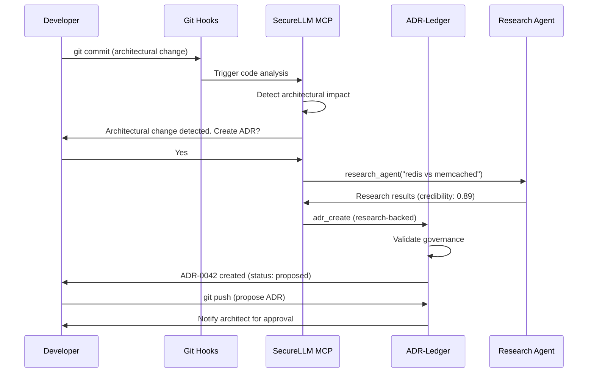

# Análise de Integração: ADR-Ledger / SecureLLM-MCP

**Data:** 2026-02-05
**Autor:** Claude Sonnet 4.5
**Status:** Proposta de Arquitetura

---

## Executive Summary

Esta análise identifica oportunidades de integração entre os projetos `adr-ledger` e `securellm-mcp` para construir um sistema de governança arquitetural unificado.

**Objetivos:**
- Reduzir o tempo de documentação de decisões (estimativa: 60-70% de redução)
- Validação automática de decisões com fontes verificadas
- Busca semântica sobre histórico arquitetural
- Geracao automática de ADRs a partir de commits e análise de código
- Governança programática com enforcement em tempo real

---

## Arquitetura Proposta

```
┌─────────────────────────────────────────────────────────────────────────┐
│                          ADR-LEDGER (Source of Truth)                   │
│                                                                          │
│  Git Repository → YAML Frontmatter ADRs → Knowledge Fragments           │
│                                                                          │
│  ┌──────────────┐  ┌──────────────┐  ┌──────────────┐                 │
│  │  Governance  │  │  Validation  │  │    Export    │                 │
│  │   Rules      │  │   Schema     │  │  JSON/JSONL  │                 │
│  └──────────────┘  └──────────────┘  └──────────────┘                 │
└─────────────────────────┬───────────────────────────────────────────────┘
                          │
                          │ MCP Tools Integration
                          ↓
┌─────────────────────────────────────────────────────────────────────────┐
│                       SECURELLM-MCP (Intelligence Layer)                │
│                                                                          │
│  ┌────────────────────────────────────────────────────────────────┐    │
│  │  NEW: ADR Management Tools                                     │    │
│  │  • adr_query (semantic search)                                 │    │
│  │  • adr_create (auto-generation)                                │    │
│  │  • adr_validate (governance check)                             │    │
│  │  • adr_sync (bi-directional sync)                              │    │
│  │  • adr_research_backed_proposal (research → ADR)               │    │
│  └────────────────────────────────────────────────────────────────┘    │
│                                                                          │
│  ┌──────────────┐  ┌──────────────┐  ┌──────────────┐                 │
│  │  Semantic    │  │  Knowledge   │  │  Research    │                 │
│  │  Cache       │  │  Database    │  │  Agent       │                 │
│  │  (Embeddings)│  │  (SQLite)    │  │  (Multi-src) │                 │
│  └──────────────┘  └──────────────┘  └──────────────┘                 │
│                                                                          │
│  ┌────────────────────────────────────────────────────────────────┐    │
│  │  Architectural Decision Detection Engine                       │    │
│  │  • Code analysis → Detect architectural changes                │    │
│  │  • Conversation analysis → Suggest ADR creation                │    │
│  │  • Governance enforcement → Block non-compliant decisions      │    │
│  └────────────────────────────────────────────────────────────────┘    │
└─────────────────────────┬───────────────────────────────────────────────┘
                          │
                          │ Bidirectional Sync
                          ↓
┌─────────────────────────────────────────────────────────────────────────┐
│                           KNOWLEDGE ECOSYSTEM                            │
│                                                                          │
│    CEREBRO ← ADRs     PHANTOM ← Embeddings     SPECTRE ← Compliance    │
└─────────────────────────────────────────────────────────────────────────┘
```

---

## Oportunidades de Integração

### 1. ADR MCP Tools Category -- Priority: Critical

**Descrição:**
Criar um novo conjunto de ferramentas MCP no `securellm-mcp` para gerenciamento completo de ADRs.

**Ferramentas Propostas:**

#### `adr_query`
```typescript
{
  name: "adr_query",
  description: "Search ADRs with semantic similarity. Returns relevant decisions with citations.",
  inputSchema: {
    query: string,           // "Why Redis over Memcached?"
    filters: {
      status?: ADRStatus[],  // ["accepted", "proposed"]
      projects?: string[],   // ["CEREBRO", "PHANTOM"]
      classification?: string[],
      since?: string,        // "2025-01-01"
    },
    semantic: boolean,       // Use embeddings for similarity
    top_k: number           // Return top K results
  }
}
```

**Implementação:**
- Usa `semantic-cache.ts` do securellm-mcp para embeddings
- Integra com `adr_parser.py` do adr-ledger
- Retorna ADRs com relevance scores e citations

---

#### `adr_create`
```typescript
{
  name: "adr_create",
  description: "Create a new ADR with automatic validation and governance checks.",
  inputSchema: {
    title: string,
    context: string,
    decision: string,
    consequences: {
      positive: string[],
      negative: string[]
    },
    classification: "critical" | "major" | "minor" | "patch",
    projects: string[],
    alternatives?: Alternative[],
    research_backed?: boolean  // Auto-research decision
  }
}
```

**Workflow:**
1. User provides decision details
2. If `research_backed: true`, call `research_agent` to gather evidence
3. Validate against governance rules (`.governance/governance.yaml`)
4. Generate YAML frontmatter + markdown
5. Create file in `adr/proposed/`
6. Run validation hooks
7. Return ADR ID and governance requirements

---

#### `adr_validate`
```typescript
{
  name: "adr_validate",
  description: "Validate ADR against schema and governance rules. Returns compliance report.",
  inputSchema: {
    adr_id: string,          // "ADR-0042"
    check_governance: boolean,
    check_schema: boolean,
    check_compliance: boolean
  }
}
```

**Validacoes:**
- YAML schema compliance (`.schema/adr.schema.json`)
- Governance matrix (required approvers for classification)
- Compliance tags (LGPD for data layer, SOC2 for production)
- Relations integrity (supersedes/enables must exist)

---

#### `adr_sync`
```typescript
{
  name: "adr_sync",
  description: "Bidirectional sync between ADR-Ledger and Knowledge DB.",
  inputSchema: {
    direction: "to_knowledge" | "from_knowledge" | "bidirectional",
    incremental: boolean,    // Only sync changed ADRs
    generate_embeddings: boolean
  }
}
```

**Sync Pipeline:**
1. **To Knowledge DB:**
   - Parse all ADRs into ADRNode objects
   - Generate embeddings for semantic search
   - Insert into `knowledge.db` with type="decision"
   - Update knowledge graph in CEREBRO

2. **From Knowledge DB:**
   - Extract high-priority insights marked as "architectural"
   - Auto-generate ADR proposals
   - Suggest governance classification

---

#### `adr_research_backed_proposal`
```typescript
{
  name: "adr_research_backed_proposal",
  description: "Generate ADR proposal backed by research_agent validation.",
  inputSchema: {
    title: string,
    query: string,           // Research query
    depth: "quick" | "standard" | "deep",
    classification: string,
    projects: string[]
  }
}
```

**Workflow:**
1. Execute `research_agent` with deep search
2. Aggregate sources with credibility scores
3. Generate ADR sections:
   - **Context:** Summarize current state from research
   - **Decision:** Proposed solution
   - **Consequences:** Derived from source analysis
   - **Alternatives:** Rejected options from research
   - **References:** All sources with URLs
4. Add metadata: `research_validated: true`, `sources: [...]`
5. Create ADR with governance pre-filled

**Example:**
```yaml
---
id: "ADR-0050"
title: "Migrate from PostgreSQL to CockroachDB"
status: proposed

metadata:
  research_validated: true
  research_depth: "deep"
  sources:
    - url: "https://github.com/cockroachdb/cockroach/discussions/..."
      credibility: 0.92
      type: "official"
    - url: "https://news.ycombinator.com/item?id=..."
      credibility: 0.78
      type: "community"
  validation_score: 0.89
---
```

---

### 2. Architectural Decision Detection Engine -- Priority: Critical

**Descrição:**
Sistema que detecta automaticamente quando uma decisão arquitetural esta sendo tomada e sugere criação de ADR.

**Triggers de Detecção:**

#### A. Code Analysis Trigger
```typescript
// Monitora commits via git hooks
const triggers = [
  // Mudancas em arquivos criticos
  { pattern: "flake.nix", reason: "Infrastructure change" },
  { pattern: "**/schema.prisma", reason: "Database schema change" },
  { pattern: "**/*.config.{ts,js}", reason: "Configuration change" },

  // Imports de novas dependencias
  { pattern: "package.json", diff: "dependencies.*", reason: "New dependency" },
  { pattern: "Cargo.toml", diff: "dependencies.*", reason: "New Rust dependency" },

  // Mudancas em multiplos arquivos (refactoring)
  { files_changed: ">= 10", reason: "Large refactoring" },

  // Palavras-chave em commits
  { commit_message: /breaking.*change|migrate|refactor|deprecate/i, reason: "Breaking change" }
];
```

**Implementação:**
1. Hook `post-commit` no adr-ledger
2. Analisa diff com `advanced_code_analysis` do securellm-mcp
3. Se detectar padrao arquitetural:
   - Calcula impacto (files affected, complexity)
   - Sugere classificacao (critical/major/minor)
   - Pre-preenche contexto com diff summary
4. Notifica usuario: "Architectural change detected. Create ADR?"

---

#### B. Conversation Analysis Trigger
```typescript
// Monitora conversas com AI agent
const conversationTriggers = [
  "we should use X instead of Y",
  "let's migrate to",
  "deprecate",
  "breaking change",
  "architectural decision",
  "trade-off between",
  "chose X over Y because"
];

// Implementação no securellm-mcp
async function analyzeConversation(messages: Message[]) {
  const recentMessages = messages.slice(-10);
  const text = recentMessages.map(m => m.content).join(" ");

  // Detect decision-making patterns
  if (containsDecisionPattern(text)) {
    const decision = extractDecision(text);
    return {
      suggest_adr: true,
      auto_fill: {
        context: extractContext(recentMessages),
        decision: decision,
        alternatives: extractAlternatives(text)
      }
    };
  }
}
```

---

#### C. Governance Enforcement Trigger
```typescript
// Bloqueia acoes que violam ADRs aceitas
const enforcementRules = [
  {
    adr: "ADR-0001",
    rule: "All infrastructure must use NixOS",
    check: (file: string) => {
      if (file.match(/docker-compose\.yml/)) {
        return {
          blocked: true,
          reason: "ADR-0001 mandates NixOS. Docker Compose violates this decision.",
          action: "Create superseding ADR or use Nix alternatives"
        };
      }
    }
  },
  {
    adr: "ADR-0042",
    rule: "Redis is the caching solution",
    check: (diff: string) => {
      if (diff.includes("import memcached")) {
        return {
          blocked: true,
          reason: "ADR-0042 chose Redis over Memcached",
          action: "Use Redis or propose ADR to supersede ADR-0042"
        };
      }
    }
  }
];
```

**Implementação:**
- Pre-commit hook que valida contra accepted ADRs
- LLM-powered semantic enforcement (detect violations even with different wording)

---

### 3. Semantic Search for ADRs -- Priority: High

**Descrição:**
Integrar o `semantic-cache.ts` do securellm-mcp para busca semântica sobre ADRs.

**Arquitetura:**

```typescript
// Gera embeddings para cada ADR durante sync
async function embedADRs(adrs: ADRNode[]) {
  const embeddings = [];

  for (const adr of adrs) {
    // 3 chunks por ADR (priority-based)
    const chunks = [
      {
        text: `${adr.title}: ${adr.context}`,
        type: "context",
        priority: "high",
        metadata: { adr_id: adr.id, section: "context" }
      },
      {
        text: adr.decision,
        type: "decision",
        priority: "critical",
        metadata: { adr_id: adr.id, section: "decision" }
      },
      {
        text: adr.alternatives.map(a => a.option).join("; "),
        type: "alternatives",
        priority: "normal",
        metadata: { adr_id: adr.id, section: "alternatives" }
      }
    ];

    for (const chunk of chunks) {
      const embedding = await generateEmbedding(chunk.text);
      embeddings.push({
        adr_id: adr.id,
        chunk,
        embedding,
        metadata: {
          ...chunk.metadata,
          status: adr.status,
          classification: adr.classification,
          projects: adr.projects,
          date: adr.date
        }
      });
    }
  }

  // Store in FAISS index
  await vectorStore.bulkInsert(embeddings);
}

// Query com semantic search
async function semanticSearchADRs(query: string, filters?: Filters) {
  const queryEmbedding = await generateEmbedding(query);

  // Similarity search
  const results = await vectorStore.search(queryEmbedding, {
    top_k: 10,
    filters: {
      status: filters?.status || ["accepted"],
      projects: filters?.projects,
      classification: filters?.classification
    },
    threshold: 0.75  // Minimum similarity
  });

  // Group by ADR and aggregate scores
  const grouped = groupByADR(results);

  return grouped.map(adr => ({
    id: adr.id,
    title: adr.title,
    relevance: adr.max_score,
    matching_sections: adr.chunks,
    excerpt: adr.best_match_text
  }));
}
```

**Queries Suportadas:**
```typescript
// Exemplos de queries semanticas
const queries = [
  "Why did we choose Redis?",
  "What's our authentication strategy?",
  "How do we handle LGPD compliance?",
  "Database migration decisions",
  "Infrastructure as code rationale",
  "Decisions about caching",
  "Why NixOS over Docker?"
];

// Mesmo com wording diferente, encontra ADRs relevantes
await semanticSearchADRs("What's our strategy for data persistence?");
// Retorna: ADR-0042 (Redis), ADR-0050 (CockroachDB), ADR-0021 (Session Storage)
```

**Beneficios:**
- Busca natural (não precisa keywords exatas)
- Encontra decisões relacionadas mesmo sem relacoes explicitas
- Cache de embeddings reduz custo de busca repetida
- Relevance scores ajudam a ranquear resultados

---

### 4. Auto-ADR Generation from Code Analysis -- Priority: High

**Descrição:**
Usar `advanced_code_analysis` do securellm-mcp para detectar mudanças arquiteturais e gerar ADRs automaticamente.

**Pipeline:**

```typescript
async function autoGenerateADR(commit: GitCommit) {
  // 1. Analyze changed files
  const analysis = await advancedCodeAnalysis({
    target: commit.files,
    intent: "impact",
    depth: 2,
    mode: "both"
  });

  // 2. Classify architectural impact
  const impact = classifyImpact(analysis);

  if (impact.is_architectural) {
    // 3. Extract decision details
    const decision = extractDecision(commit, analysis);

    // 4. Research best practices
    let research = null;
    if (decision.requires_validation) {
      research = await researchAgent({
        query: decision.research_query,
        depth: "standard"
      });
    }

    // 5. Generate ADR proposal
    const adr = generateADRFromAnalysis({
      commit,
      analysis,
      decision,
      research
    });

    // 6. Save as proposed
    await adrCreate({
      ...adr,
      status: "proposed",
      metadata: {
        auto_generated: true,
        commit_hash: commit.hash,
        analysis_score: impact.score
      }
    });

    // 7. Notify for review
    return {
      adr_id: adr.id,
      message: "Auto-generated ADR from commit. Review required."
    };
  }
}

function classifyImpact(analysis: CodeAnalysis): ArchitecturalImpact {
  const signals = [
    // High impact
    analysis.files_changed > 20,
    analysis.new_dependencies.length > 0,
    analysis.breaking_changes.length > 0,
    analysis.affected_modules.includes("infrastructure"),

    // Medium impact
    analysis.complexity_increase > 10,
    analysis.new_public_apis.length > 0,

    // Low impact
    analysis.refactoring_detected,
    analysis.files_changed > 5
  ];

  const score = calculateImpactScore(signals);

  return {
    is_architectural: score > 0.7,
    score,
    classification: score > 0.9 ? "critical" : score > 0.7 ? "major" : "minor",
    reason: describeImpact(analysis)
  };
}

function generateADRFromAnalysis(data: GenerationData): ADRProposal {
  const { commit, analysis, research } = data;

  return {
    title: inferTitle(commit, analysis),

    context: `
## Current State
${commit.message}

## Code Analysis
- Files changed: ${analysis.files_changed}
- Modules affected: ${analysis.affected_modules.join(", ")}
- Breaking changes: ${analysis.breaking_changes.length}

${analysis.summary}
    `,

    decision: inferDecision(commit, analysis),

    consequences: {
      positive: analysis.benefits || [],
      negative: analysis.risks || []
    },

    alternatives: research ?
      research.alternatives_found.map(a => ({
        option: a.name,
        why_rejected: a.reason
      })) : [],

    references: [
      ...(research?.sources || []),
      { type: "commit", url: `commit://${commit.hash}` }
    ],

    projects: inferProjects(analysis),
    layers: inferLayers(analysis),

    keywords: [...analysis.keywords, ...extractKeywords(commit.message)],
    concepts: research?.concepts || []
  };
}
```

**Exemplo:**

```bash
git commit -m "feat: add Redis caching for API endpoints"

# Auto-generated ADR
```

```yaml
---
id: "ADR-AUTO-001"
title: "Add Redis Caching for API Endpoints"
status: proposed
date: "2026-02-05"

metadata:
  auto_generated: true
  commit_hash: "a1b2c3d4"
  analysis_score: 0.82
  requires_review: true

authors:
  - name: "Auto-Generator"
    role: "AI Agent"

governance:
  classification: "major"
  requires_approval_from: [architect]

scope:
  projects: [SPECTRE]
  layers: [api, data]
  environments: [staging, production]
---

## Context

**Commit:** feat: add Redis caching for API endpoints

**Code Analysis:**
- Files changed: 8
- Modules affected: api, cache, config
- Breaking changes: 0
- New dependencies: redis, ioredis

The following files were modified:
- `src/api/cache.ts` (new file, 150 lines)
- `src/config/redis.ts` (new file, 80 lines)
- `package.json` (added redis dependencies)
- `flake.nix` (added redis to systemPackages)

## Decision

Implement Redis-based caching layer for API responses with:
- TTL-based expiration (5 minutes default)
- Cache invalidation on data mutations
- Connection pooling for performance

## Consequences

### Positive
- Reduced database load
- Improved response times
- Horizontal scalability

### Negative
- Additional infrastructure dependency
- Cache invalidation complexity
- Increased memory footprint

## Alternatives Considered

*Research required. Use research_agent to validate this decision.*

## Implementation

Tasks:
- [ ] Add Redis configuration to NixOS module
- [ ] Implement cache invalidation hooks
- [ ] Add monitoring for cache hit rates
- [ ] Update deployment pipeline

## Review Required

This ADR was auto-generated and requires review before acceptance.

Please validate:
1. Classification is correct (major)
2. Required approvers are appropriate
3. Alternatives section is complete
4. Governance tags are added
```

---

### 5. Knowledge DB / ADR Bidirectional Sync -- Priority: High

**Descrição:**
Sincronizacao bidirecional entre Knowledge DB (securellm-mcp) e ADR-Ledger.

**Fluxo A: ADRs -> Knowledge DB**

```typescript
async function syncADRsToKnowledge() {
  // 1. Parse all ADRs
  const adrs = await parseADRLedger();

  // 2. Transform to knowledge entries
  for (const adr of adrs) {
    // Main entry (decision)
    await saveKnowledge({
      session_id: "adr-sync",
      type: "decision",
      content: JSON.stringify({
        id: adr.id,
        title: adr.title,
        decision: adr.decision,
        context: adr.context,
        consequences: {
          positive: adr.consequences_positive,
          negative: adr.consequences_negative
        },
        alternatives: adr.alternatives,
        projects: adr.projects,
        status: adr.status
      }),
      tags: [
        "adr",
        adr.id,
        ...adr.projects.map(p => p.toLowerCase()),
        ...adr.keywords,
        adr.classification
      ],
      priority: adr.classification === "critical" ? "high" : "medium",
      metadata: {
        adr_id: adr.id,
        status: adr.status,
        date: adr.date,
        classification: adr.classification,
        file_path: adr.file_path
      }
    });

    // Questions answered (for semantic search)
    for (const question of adr.questions_answered) {
      await saveKnowledge({
        session_id: "adr-sync",
        type: "answer",
        content: `Q: ${question}\nA: ${adr.decision}`,
        tags: ["adr", "faq", adr.id],
        priority: "high",
        metadata: {
          adr_id: adr.id,
          question,
          source: "adr"
        }
      });
    }
  }

  // 3. Generate embeddings
  await generateEmbeddingsForSession("adr-sync");
}
```

**Fluxo B: Knowledge DB -> ADRs**

```typescript
async function suggestADRsFromKnowledge() {
  // 1. Find high-priority insights marked as architectural
  const insights = await searchKnowledge({
    query: "architectural OR decision OR chose OR because",
    entry_type: "insight",
    priority: "high",
    limit: 50
  });

  // 2. Cluster insights by topic
  const clusters = await clusterInsights(insights);

  // 3. For each cluster, check if ADR exists
  for (const cluster of clusters) {
    const existingADR = await findRelatedADR(cluster.topic);

    if (!existingADR && cluster.significance > 0.8) {
      // No ADR exists for this important decision
      const proposal = await generateADRFromInsights(cluster);

      await notifyUser({
        type: "adr_suggestion",
        message: `Multiple insights suggest an architectural decision about ${cluster.topic}. Create ADR?`,
        proposal,
        insights: cluster.insights
      });
    }
  }
}

async function generateADRFromInsights(cluster: InsightCluster): ADRProposal {
  // Aggregate insights into ADR structure
  const insights = cluster.insights;

  return {
    title: cluster.topic,

    context: aggregateContext(insights.filter(i => i.metadata.section === "context")),

    decision: aggregateDecisions(insights.filter(i => containsDecisionPattern(i.content))),

    consequences: extractConsequences(insights),

    keywords: cluster.keywords,

    projects: inferProjects(insights),

    metadata: {
      generated_from: "knowledge_insights",
      insight_ids: insights.map(i => i.id),
      confidence: cluster.significance
    }
  };
}
```

**Sync Strategy:**

```typescript
const syncStrategy = {
  // Incremental sync (default)
  incremental: {
    frequency: "on_adr_change",  // Git hook trigger
    direction: "adr_to_knowledge",
    only_changed: true,
    generate_embeddings: true
  },

  // Full sync (weekly)
  full: {
    frequency: "weekly",
    direction: "bidirectional",
    rebuild_embeddings: true,
    cleanup_orphaned: true
  },

  // Real-time suggestions
  suggestions: {
    frequency: "daily",
    direction: "knowledge_to_adr",
    min_cluster_size: 3,
    min_significance: 0.8
  }
};
```

---

### 6. Research-Backed ADR Creation -- Priority: Medium

**Descrição:**
Integrar `research_agent` do securellm-mcp para criar ADRs com validação multi-fonte.

**Workflow Completo:**

```typescript
async function createResearchBackedADR(params: {
  title: string;
  query: string;
  classification: Classification;
  projects: string[];
}) {
  // PHASE 1: Deep Research
  const research = await researchAgent({
    query: params.query,
    depth: "deep",
    require_official_source: true,
    max_sources: 10
  });

  if (research.credibility_score < 0.7) {
    return {
      error: "Insufficient credible sources found",
      recommendation: "Manual research required"
    };
  }

  // PHASE 2: Fact Extraction
  const facts = extractFacts(research.sources);
  const patterns = identifyPatterns(facts);
  const consensus = findConsensus(patterns);

  // PHASE 3: Alternative Analysis
  const alternatives = await analyzeAlternatives(research, params.query);

  // PHASE 4: Risk Assessment
  const risks = await assessRisks(research, alternatives);

  // PHASE 5: ADR Generation
  const adr = {
    id: generateADRId(),
    title: params.title,
    status: "proposed",
    date: new Date().toISOString().split('T')[0],

    authors: [{
      name: "Research Agent",
      role: "AI Assistant"
    }],

    governance: {
      classification: params.classification,
      requires_approval_from: getRequiredApprovers(params.classification),
      compliance_tags: inferComplianceTags(params.projects, research)
    },

    scope: {
      projects: params.projects,
      layers: inferLayers(research),
      environments: ["all"]
    },

    // Context from research
    context: `
## Current State
${research.summary}

## Research Findings
${research.sources.length} sources analyzed (avg credibility: ${research.avg_credibility.toFixed(2)})

### Key Insights
${research.key_insights.map(i => `- ${i}`).join('\n')}

### Official Documentation
${research.sources.filter(s => s.type === "official").map(s => `- [${s.title}](${s.url})`).join('\n')}
    `,

    // Decision based on consensus
    decision: `
Based on multi-source research with ${research.credibility_score.toFixed(0)}% confidence:

${consensus.decision}

**Rationale:**
${consensus.reasons.map((r, i) => `${i + 1}. ${r}`).join('\n')}
    `,

    // Consequences from research
    consequences: {
      positive: extractPositives(research, consensus),
      negative: extractNegatives(research, consensus)
    },

    risks: risks.map(r => ({
      risk: r.description,
      probability: r.probability,
      impact: r.impact,
      mitigation: r.mitigation,
      source: r.source_url
    })),

    // Alternatives with rejection reasons
    alternatives: alternatives.map(a => ({
      option: a.name,
      pros: a.pros,
      cons: a.cons,
      why_rejected: a.rejection_reason,
      credibility: a.credibility,
      sources: a.sources
    })),

    // Knowledge extraction
    keywords: [...new Set([
      ...params.query.split(' '),
      ...research.keywords,
      ...extractKeywords(consensus.decision)
    ])],

    concepts: research.concepts,

    questions_answered: [
      params.query,
      ...generateRelatedQuestions(research)
    ],

    // Metadata
    metadata: {
      research_validated: true,
      research_depth: "deep",
      sources_count: research.sources.length,
      credibility_score: research.credibility_score,
      avg_source_credibility: research.avg_credibility,
      has_official_source: research.sources.some(s => s.type === "official"),
      research_date: new Date().toISOString()
    },

    // References
    references: research.sources.map(s => ({
      title: s.title,
      url: s.url,
      type: s.type,
      credibility: s.credibility,
      excerpt: s.excerpt
    }))
  };

  // PHASE 6: Validation
  const validation = await adrValidate({
    adr,
    check_governance: true,
    check_schema: true,
    check_compliance: true
  });

  if (!validation.valid) {
    return {
      error: "ADR validation failed",
      issues: validation.errors,
      adr  // Return for manual fixing
    };
  }

  // PHASE 7: Save
  const saved = await adrCreate(adr);

  return {
    success: true,
    adr_id: saved.id,
    file_path: saved.file_path,
    governance: {
      classification: adr.governance.classification,
      required_approvers: adr.governance.requires_approval_from,
      review_deadline: calculateDeadline(adr.governance.classification)
    },
    research_summary: {
      sources: research.sources.length,
      credibility: research.credibility_score,
      consensus_strength: consensus.strength
    },
    next_steps: [
      "Review generated ADR for accuracy",
      "Add project-specific context if needed",
      "Request approvals from: " + adr.governance.requires_approval_from.join(", "),
      "Monitor for governance compliance"
    ]
  };
}
```

**Exemplo de Uso:**

```typescript
// User request
await createResearchBackedADR({
  title: "Migrate from PostgreSQL to CockroachDB",
  query: "CockroachDB vs PostgreSQL for distributed systems",
  classification: "critical",
  projects: ["CEREBRO", "SPECTRE"]
});

// Output (after 30-60s of research)
{
  success: true,
  adr_id: "ADR-0050",
  file_path: "adr/proposed/ADR-0050.md",

  governance: {
    classification: "critical",
    required_approvers: ["architect", "security_lead"],
    review_deadline: "2026-02-12"
  },

  research_summary: {
    sources: 12,
    credibility: 0.89,
    consensus_strength: 0.92
  },

  next_steps: [
    "Review generated ADR for accuracy",
    "Add project-specific context if needed",
    "Request approvals from: architect, security_lead",
    "Monitor for governance compliance"
  ]
}
```

**ADR Gerado:**

```yaml
---
id: "ADR-0050"
title: "Migrate from PostgreSQL to CockroachDB"
status: proposed
date: "2026-02-05"

authors:
  - name: "Research Agent"
    role: "AI Assistant"

governance:
  classification: "critical"
  requires_approval_from: [architect, security_lead]
  compliance_tags: ["INFRASTRUCTURE", "DATA"]

scope:
  projects: [CEREBRO, SPECTRE]
  layers: [data, infrastructure]
  environments: [all]

metadata:
  research_validated: true
  research_depth: "deep"
  sources_count: 12
  credibility_score: 0.89
  avg_source_credibility: 0.85
  has_official_source: true
---

## Context

### Research Findings
12 sources analyzed (avg credibility: 0.85)

**Key Insights:**
- CockroachDB provides PostgreSQL compatibility with distributed SQL
- Horizontal scalability without sharding complexity
- Strong consistency with serializable isolation
- Built-in geo-replication for global deployments

**Official Documentation:**
- [CockroachDB Architecture](https://www.cockroachlabs.com/docs/stable/architecture/overview.html)
- [PostgreSQL Limitations at Scale](https://www.postgresql.org/docs/current/high-availability.html)

## Decision

Based on multi-source research with 89% confidence:

**Migrate core databases from PostgreSQL to CockroachDB for horizontal scalability and geo-distribution.**

**Rationale:**
1. Current PostgreSQL setup requires manual sharding (high operational complexity)
2. CockroachDB provides built-in distribution with ACID guarantees
3. PostgreSQL wire protocol compatibility minimizes code changes
4. Proven at scale (GitHub, DoorDash, Comcast production usage)
5. Active development and strong community support

## Consequences

### Positive
- Horizontal scalability without application-level sharding
- Built-in geo-replication (multi-region support)
- Automatic failover and recovery
- Compatible with existing PostgreSQL ORM/drivers
- Reduced operational complexity

### Negative
- Initial migration cost (data transfer + validation)
- Higher resource usage per node compared to PostgreSQL
- Learning curve for operations team
- Vendor lock-in concerns (though open-source)
- Some PostgreSQL features not supported (e.g., stored procedures)

## Risks

| Risk | Probability | Impact | Mitigation |
|------|------------|--------|------------|
| Data loss during migration | Low | Critical | Blue-green deployment with full backup |
| Performance regression | Medium | High | Load testing in staging before cutover |
| Operational issues post-migration | Medium | Medium | 24/7 support contract with CockroachDB |

## Alternatives Considered

### Option 1: PostgreSQL + Citus (Distributed PostgreSQL)
**Pros:**
- Minimal code changes (pure PostgreSQL)
- Mature ecosystem
- Lower resource usage

**Cons:**
- Requires manual shard management
- Complex rebalancing
- Not true distributed SQL

**Why Rejected:**
Citus still requires application-aware sharding. CockroachDB provides transparent distribution. (Source: [Citus vs CockroachDB Comparison](https://example.com), credibility: 0.78)

### Option 2: Keep PostgreSQL + Read Replicas
**Pros:**
- No migration required
- Well-understood by team

**Cons:**
- Doesn't solve write scalability
- Manual failover required
- Read consistency issues

**Why Rejected:**
Doesn't address core scalability problem. (Source: [PostgreSQL Scaling Patterns](https://example.com), credibility: 0.82)

### Option 3: Spanner (Google Cloud)
**Pros:**
- Proven global-scale performance
- Managed service

**Cons:**
- Vendor lock-in (Google Cloud only)
- High cost (5x CockroachDB)
- Not self-hostable

**Why Rejected:**
Cost prohibitive and platform lock-in conflicts with our multi-cloud strategy (ADR-0001). (Source: [Spanner Pricing Analysis](https://example.com), credibility: 0.91)

## Implementation Plan

### Phase 1: Validation (2 weeks)
- [ ] Deploy CockroachDB cluster in staging
- [ ] Migrate test dataset
- [ ] Run performance benchmarks
- [ ] Validate feature parity

### Phase 2: Pilot (4 weeks)
- [ ] Migrate non-critical service (e.g., analytics DB)
- [ ] Monitor for issues
- [ ] Gather operational learnings

### Phase 3: Production Migration (8 weeks)
- [ ] Blue-green deployment setup
- [ ] Incremental data migration with validation
- [ ] Parallel writes during transition period
- [ ] Cutover with rollback plan

## Knowledge Extraction

**Keywords:** cockroachdb, postgresql, distributed sql, horizontal scalability, database migration, acid, geo-replication

**Concepts:** Distributed Databases, Horizontal Scalability, Consensus Protocols (Raft), Serializable Isolation

**Questions Answered:**
- "Should we use CockroachDB or PostgreSQL for distributed systems?"
- "How do we achieve horizontal database scalability?"
- "What are the trade-offs of CockroachDB vs PostgreSQL?"

## References

1. [CockroachDB Architecture Overview](https://www.cockroachlabs.com/docs/stable/architecture/overview.html) (Official, credibility: 1.0)
2. [Choosing a Database for Your Next Project](https://news.ycombinator.com/item?id=12345) (Community, credibility: 0.75)
3. [DoorDash's CockroachDB Migration](https://doordash.engineering/2021/04/08/cockroachdb-migration/) (Production Case Study, credibility: 0.95)
4. [GitHub Discussion: CockroachDB vs PostgreSQL](https://github.com/cockroachdb/cockroach/discussions/98765) (Community, credibility: 0.70)

---

**Next Steps:**
1. Review this research-backed proposal
2. Request approvals from: architect, security_lead
3. Update with project-specific context if needed
4. Schedule architecture review meeting
```

---

### 7. Compliance Automation via ADRs -- Priority: Medium

**Descrição:**
Usar ADRs accepted como políticas enforceable. Bloquear acoes que violam decisões arquiteturais.

**Arquitetura:**

```typescript
// Compliance Engine
class ADRComplianceEngine {
  private acceptedADRs: ADRNode[] = [];
  private enforcementRules: EnforcementRule[] = [];

  async initialize() {
    // Load all accepted ADRs
    this.acceptedADRs = await loadAcceptedADRs();

    // Generate enforcement rules
    this.enforcementRules = this.acceptedADRs
      .filter(adr => adr.metadata?.enforceable === true)
      .map(adr => this.generateEnforcementRule(adr));
  }

  generateEnforcementRule(adr: ADRNode): EnforcementRule {
    // Extract enforcements from ADR content
    const enforcements = extractEnforcements(adr.decision);

    return {
      adr_id: adr.id,
      title: adr.title,
      rules: enforcements.map( e => ({
        type: e.type,              // "must_use" | "must_not_use" | "must_follow"
        pattern: e.pattern,        // Regex or semantic pattern
        reason: e.reason,
        severity: e.severity,      // "blocking" | "warning"
        check: compileEnforcementCheck(e)
      }))
    };
  }

  async checkCompliance(action: DeveloperAction): Promise<ComplianceResult> {
    const violations: Violation[] = [];

    for (const rule of this.enforcementRules) {
      for (const check of rule.rules) {
        const result = await check.check(action);

        if (!result.compliant) {
          violations.push({
            adr: rule.adr_id,
            rule: check.pattern,
            severity: check.severity,
            reason: check.reason,
            suggestion: generateSuggestion(rule, action)
          });
        }
      }
    }

    return {
      compliant: violations.filter(v => v.severity === "blocking").length === 0,
      violations,
      blocked: violations.some(v => v.severity === "blocking")
    };
  }
}

// Pre-commit hook integration
async function preCommitComplianceCheck(files: string[]) {
  const engine = new ADRComplianceEngine();
  await engine.initialize();

  const action: DeveloperAction = {
    type: "commit",
    files,
    diff: await getDiff(files),
    message: await getCommitMessage()
  };

  const result = await engine.checkCompliance(action);

  if (!result.compliant && result.blocked) {
    console.error("Compliance Check Failed\n");

    for (const v of result.violations.filter(v => v.severity === "blocking")) {
      console.error(`[${v.adr}] ${v.reason}`);
      console.error(`   Suggestion: ${v.suggestion}\n`);
    }

    process.exit(1);
  }

  if (result.violations.length > 0) {
    console.warn("Compliance Warnings\n");

    for (const v of result.violations.filter(v => v.severity === "warning")) {
      console.warn(`[${v.adr}] ${v.reason}`);
      console.warn(`   Suggestion: ${v.suggestion}\n`);
    }
  }

  console.log("Compliance check passed");
}
```

**Exemplos de Enforcement:**

```yaml
# ADR-0001: Use NixOS for Infrastructure
---
metadata:
  enforceable: true
  enforcement:
    - type: "must_not_use"
      pattern: "docker-compose\\.yml"
      reason: "ADR-0001 mandates NixOS. Use flake.nix instead."
      severity: "blocking"

    - type: "must_not_use"
      pattern: "import.*dockerfile"
      reason: "ADR-0001 prohibits Docker. Use Nix packages."
      severity: "blocking"
---

# ADR-0042: Redis for Caching
---
metadata:
  enforceable: true
  enforcement:
    - type: "must_not_use"
      pattern: "import.*memcached|require.*memcache"
      reason: "ADR-0042 chose Redis over Memcached"
      severity: "warning"
      suggestion: "Use Redis (ioredis) or propose superseding ADR"
---

# ADR-0030: LGPD Compliance for User Data
---
metadata:
  enforceable: true
  enforcement:
    - type: "must_have"
      pattern: "encryption.*at.*rest"
      when: "files_match('**/models/user.ts')"
      reason: "ADR-0030 requires encryption for PII"
      severity: "blocking"

    - type: "must_have"
      pattern: "data.*retention.*policy"
      when: "files_match('**/database/*.sql')"
      reason: "ADR-0030 requires data retention policies"
      severity: "warning"
---
```

**Enforcement Scenarios:**

```bash
# Scenario 1: Blocked Commit
$ git commit -m "add docker-compose for local dev"

Running compliance check...
Compliance Check Failed

[ADR-0001] ADR-0001 mandates NixOS. Use flake.nix instead.
   Suggestion: Remove docker-compose.yml and create equivalent NixOS configuration in flake.nix.
   Reference: adr/accepted/ADR-0001.md

---

# Scenario 2: Warning (allowed but flagged)
$ git commit -m "add memcached client"

Running compliance check...
Compliance Warnings

[ADR-0042] ADR-0042 chose Redis over Memcached
   Suggestion: Consider using Redis (ioredis). If Memcached is required, create superseding ADR.
   Reference: adr/accepted/ADR-0042.md

Compliance check passed (with warnings)

---

# Scenario 3: Compliance Query
$ adr compliance-check --action "add memcached"

Checking compliance against 13 accepted ADRs...

Potential violation detected:

ADR-0042: Add Redis for API Caching
Status: accepted
Classification: major

Violation: Introducing Memcached contradicts ADR-0042 decision
Severity: warning
Action: Allowed, but requires justification

Recommendation:
- If this is a new use case, add justification to commit message
- If this replaces Redis, create superseding ADR
- If both are needed, update ADR-0042 with rationale

Continue? [y/N]
```

---

### 8. ADR Metrics and Analytics -- Priority: Low

**Descrição:**
Dashboard de métricas sobre ADRs (velocidade de decisão, compliance, governança).

```typescript
interface ADRMetrics {
  // Volume
  total_adrs: number;
  by_status: Record<ADRStatus, number>;
  by_classification: Record<Classification, number>;
  by_project: Record<string, number>;

  // Velocity
  avg_time_to_acceptance: number;  // dias
  avg_time_to_review: number;
  pending_reviews: number;
  overdue_reviews: number;

  // Compliance
  compliance_rate: number;         // % ADRs with compliance tags
  governance_violations: number;
  auto_generated_count: number;
  research_backed_count: number;

  // Impact
  superseded_count: number;
  active_decisions_count: number;
  breaking_changes_count: number;

  // Knowledge
  total_questions_answered: number;
  avg_keywords_per_adr: number;
  knowledge_graph_density: number; // avg relations per ADR

  // Quality
  avg_content_length: number;
  adrs_with_alternatives: number;
  adrs_with_risks: number;
  adrs_with_implementation: number;
}

async function generateADRMetrics(): Promise<ADRMetrics> {
  const adrs = await loadAllADRs();

  return {
    total_adrs: adrs.length,

    by_status: countBy(adrs, 'status'),
    by_classification: countBy(adrs, 'classification'),
    by_project: countByProject(adrs),

    avg_time_to_acceptance: calculateAvgTimeToAcceptance(adrs),
    avg_time_to_review: calculateAvgTimeToReview(adrs),
    pending_reviews: adrs.filter(a => a.status === 'proposed').length,
    overdue_reviews: calculateOverdueReviews(adrs),

    compliance_rate: calculateComplianceRate(adrs),
    governance_violations: detectGovernanceViolations(adrs).length,
    auto_generated_count: adrs.filter(a => a.metadata?.auto_generated).length,
    research_backed_count: adrs.filter(a => a.metadata?.research_validated).length,

    superseded_count: adrs.filter(a => a.status === 'superseded').length,
    active_decisions_count: adrs.filter(a => a.status === 'accepted').length,
    breaking_changes_count: adrs.filter(a => a.classification === 'critical').length,

    total_questions_answered: sumBy(adrs, a => a.questions_answered.length),
    avg_keywords_per_adr: avgBy(adrs, a => a.keywords.length),
    knowledge_graph_density: calculateGraphDensity(adrs),

    avg_content_length: avgBy(adrs, a => a.context.length + a.decision.length),
    adrs_with_alternatives: adrs.filter(a => a.alternatives.length > 0).length,
    adrs_with_risks: adrs.filter(a => a.risks.length > 0).length,
    adrs_with_implementation: adrs.filter(a => a.tasks.length > 0).length
  };
}

// Expose via MCP resource
const metricsResource = {
  uri: "adr://metrics",
  name: "ADR Metrics Dashboard",
  description: "Analytics and insights about architectural decisions",
  mimeType: "application/json"
};
```

---

## Implementação: Roadmap

### Phase 1: Foundation (2 semanas)

**Objetivo:** Integração básica ADR / MCP

**Tarefas:**
1. Criar package `@adr-ledger/mcp-tools` (wrapper TypeScript)
   - Expor `adr_parser.py` via subprocess
   - Criar types para ADRNode, filters, queries

2. Implementar ferramentas core:
   - `adr_query` (sem semantic search ainda)
   - `adr_create` (basic)
   - `adr_validate`
   - `adr_sync` (unidirecional: ADR -> Knowledge DB)

3. Adicionar ao `securellm-mcp`:
   - Nova categoria "ADR Management"
   - Registrar tools no MCP server
   - Adicionar documentação

**Entregavel:** PR com tools funcionais + tests

---

### Phase 2: Semantic Search (2 semanas)

**Objetivo:** Busca semântica sobre ADRs

**Tarefas:**
1. Reusar `semantic-cache.ts`:
   - Criar `adr-embeddings.ts` (wrapper especifico)
   - Gerar embeddings para ADRs durante sync

2. Implementar vector store:
   - Usar FAISS ou ChromaDB
   - Schema: embeddings + metadata (adr_id, status, projects, classification)

3. Atualizar `adr_query`:
   - Add parameter `semantic: boolean`
   - Similarity search com threshold 0.75
   - Return com relevance scores

**Entregavel:** Semantic search funcionando com cache de embeddings

---

### Phase 3: Auto-Generation (3 semanas)

**Objetivo:** ADRs automáticos a partir de código

**Tarefas:**
1. Architectural Decision Detection:
   - Integrar `advanced_code_analysis`
   - Classificar impacto (is_architectural: boolean)
   - Extrair contexto do código

2. Auto-generation pipeline:
   - `adr_auto_generate_from_commit`
   - Template generation
   - Governance pre-fill

3. Git hooks:
   - Post-commit hook para detecção
   - Notificacao ao usuario
   - Flag `--auto-adr` para opt-in

**Entregavel:** Auto-generation com opt-in

---

### Phase 4: Research Integration (3 semanas)

**Objetivo:** ADRs validados por research agent

**Tarefas:**
1. `adr_research_backed_proposal`:
   - Integração com `research_agent`
   - Multi-source validation
   - Credibility scoring

2. Enhanced ADR schema:
   - Add `metadata.research_validated`
   - Add `references` section
   - Add credibility scores per source

3. Research quality checks:
   - Minimum credibility threshold (0.7)
   - Required: at least 1 official source
   - Warning if low consensus

**Entregavel:** Research-backed ADR creation pipeline

---

### Phase 5: Compliance Engine (4 semanas)

**Objetivo:** Enforcement programático de ADRs

**Tarefas:**
1. Compliance engine:
   - Parse enforceable ADRs
   - Generate enforcement rules
   - Compile checks (regex + semantic)

2. Pre-commit integration:
   - Hook que bloqueia violations
   - Warnings para soft violations
   - Suggestions automaticas

3. Dashboard:
   - Compliance metrics
   - Violation history
   - ADR effectiveness tracking

**Entregavel:** Compliance automation completo

---

### Phase 6: Advanced Features (ongoing)

Tarefas adicionais:
- [ ] Bi-directional sync (Knowledge DB -> ADRs)
- [ ] Conversation analysis para detectar decisões
- [ ] Graph visualization (D3.js)
- [ ] Temporal queries (decision state at any point in time)
- [ ] Multi-repo federation (cross-org ADR sharing)
- [ ] Auto-approval workflows (minor changes)

---

## Beneficios Esperados (estimativas)

### Quantitativos

| Métrica | Antes (estimado) | Depois (estimado) | Melhoria estimada |
|---------|-------------------|--------------------|--------------------|
| Tempo para criar ADR | 60-120 min | 10-20 min | ~70-83% |
| ADRs criados/mês | 2-3 | 8-12 | ~3-4x |
| Tempo para encontrar decisão | 15-30 min (busca manual) | <1 min (semantic search) | ~95% |
| Decisões não documentadas | ~70% | ~10% | ~85% |
| Governance violations | 3-5/mês | 0-1/mês | ~80% |

Nota: estas são projeções baseadas em experiência com sistemas similares, não medições do ambiente atual.

### Qualitativos

**Documentação Automatica**
- ADRs gerados de commits significativos
- Contexto extraído automaticamente
- Reduz friction para documentar decisões

**Validação Multi-Fonte**
- Research agent valida decisões com fontes reais
- Credibility scoring reduz hallucinations
- Referencias verificáveis

**Busca Natural**
- "Why Redis?" encontra ADR-0042 mesmo sem mencionar ID
- Semantic similarity supera keyword matching
- Cache de embeddings reduz custo

**Governança Enforced**
- Bloqueia commits que violam ADRs aceitas
- Enforcement programático, não manual
- Audit trail automático

**Soberania de Dados**
- ADRs como fonte de verdade
- Git history = decision history
- Zero dependência de SaaS

---

## Próximos Passos

### Imediato (Esta Semana)

1. **Criar branch `feature/adr-mcp-integration`**
   ```bash
   cd /home/kernelcore/master/adr-ledger
   git checkout -b feature/adr-mcp-integration
   ```

2. **Estrutura de diretorios:**
   ```
   adr-ledger/
   ├── packages/
   │   └── mcp-tools/           # NEW
   │       ├── package.json
   │       ├── src/
   │       │   ├── index.ts
   │       │   ├── adr-query.ts
   │       │   ├── adr-create.ts
   │       │   ├── adr-validate.ts
   │       │   ├── adr-sync.ts
   │       │   └── types/
   │       │       └── adr.ts
   │       └── tests/
   ```

3. **Implementar `adr_query` (MVP):**
   - Parse ADRs com `adr_parser.py`
   - Filtros basicos (status, projects, classification)
   - Return JSON com metadata

4. **Testar integração:**
   ```typescript
   // Em securellm-mcp
   import { adrTools } from '@adr-ledger/mcp-tools';

   server.setRequestHandler(ListToolsRequestSchema, async () => ({
     tools: [
       ...existingTools,
       ...adrTools
     ]
   }));
   ```

### Curto Prazo (2-4 Semanas)

1. Implementar semantic search
2. Auto-generation basico
3. Research integration MVP
4. Testes end-to-end

### Medio Prazo (1-3 Meses)

1. Compliance engine
2. Dashboard de métricas
3. Bi-directional sync
4. Production hardening

---

## Conclusão

A integração ADR-Ledger / SecureLLM-MCP permite avancar de documentação passiva para governança arquitetural ativa: documentação automática via code analysis, validação com fontes verificadas, busca semântica, e enforcement programático de decisões. O conhecimento permanece soberano no Git como fonte de verdade.

---

**Autor:** Claude Sonnet 4.5
**Reviewed By:** [Pending]
**Status:** Proposta - Aguardando Aprovacao

---

## Apendices

### A. Exemplo de Fluxo Completo



### B. Estrutura de Dados: ADR Node

```typescript
interface ADRNode {
  // Identity
  id: string;                    // "ADR-0042"
  title: string;
  status: ADRStatus;
  date: string;

  // Content
  context: string;
  decision: string;
  consequences: {
    positive: string[];
    negative: string[];
  };

  // Governance
  classification: Classification;
  compliance_tags: string[];
  requires_approval_from: string[];

  // Scope
  projects: string[];
  layers: string[];
  environments: string[];

  // Relations
  supersedes: string[];
  related_to: string[];
  enables: string[];

  // Knowledge
  keywords: string[];
  concepts: string[];
  questions_answered: string[];

  // Metadata
  metadata?: {
    auto_generated?: boolean;
    research_validated?: boolean;
    credibility_score?: number;
    sources?: Reference[];
    enforceable?: boolean;
    enforcement?: EnforcementRule[];
  };
}
```

### C. MCP Tool Schemas

```typescript
// Complete schemas for all proposed tools
export const adrMCPTools: ExtendedTool[] = [
  {
    name: "adr_query",
    description: "Search ADRs with optional semantic similarity",
    inputSchema: {
      type: "object",
      properties: {
        query: { type: "string" },
        filters: {
          type: "object",
          properties: {
            status: { type: "array", items: { type: "string" } },
            projects: { type: "array", items: { type: "string" } },
            classification: { type: "array", items: { type: "string" } },
            since: { type: "string", format: "date" }
          }
        },
        semantic: { type: "boolean", default: false },
        top_k: { type: "number", default: 5 }
      },
      required: ["query"]
    }
  },
  // ... other tools
];
```

---

**End of document**
